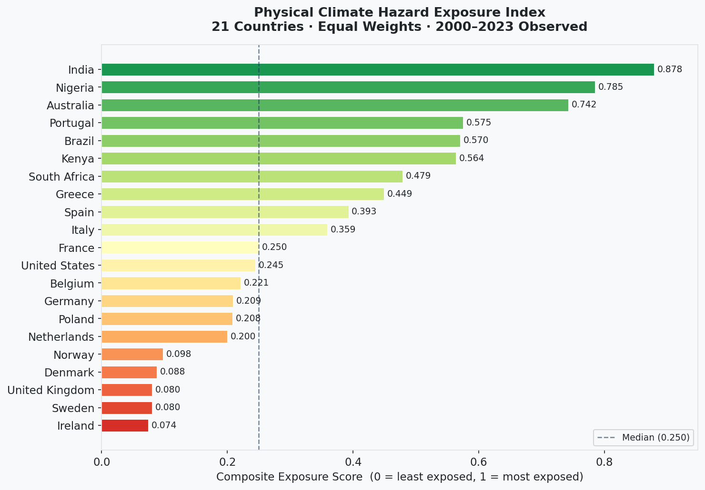
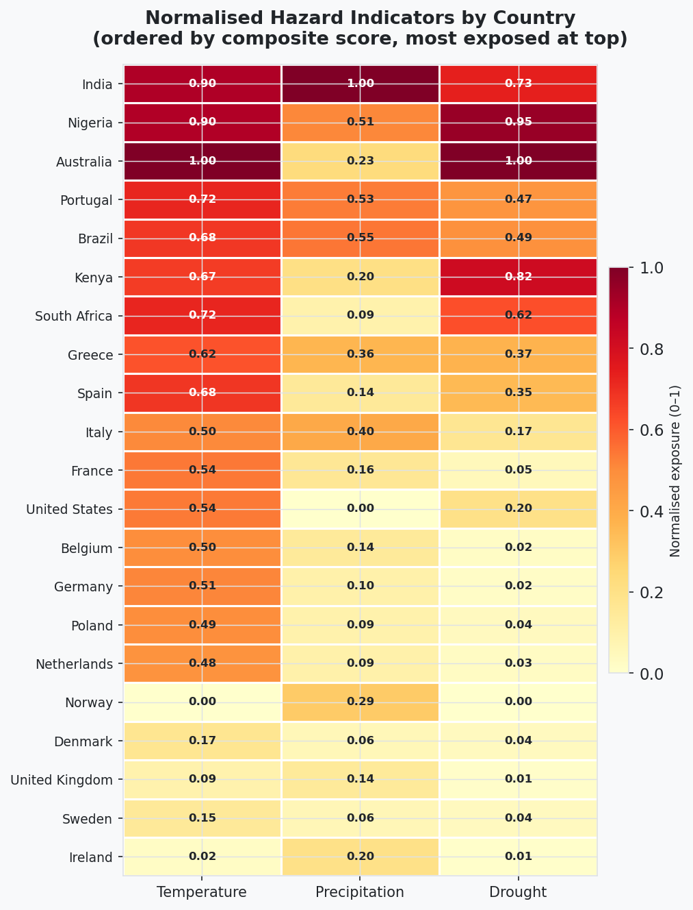
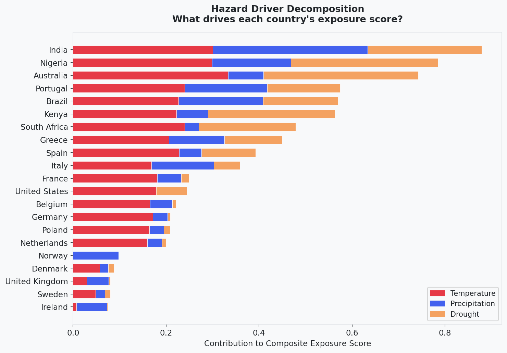
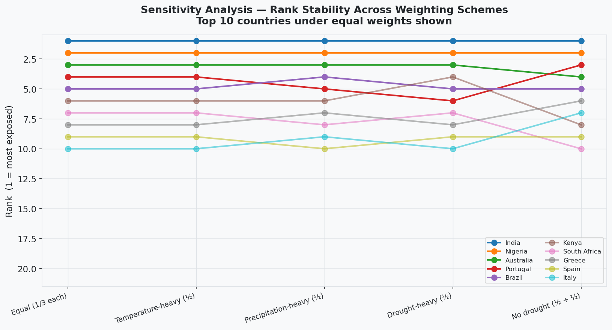
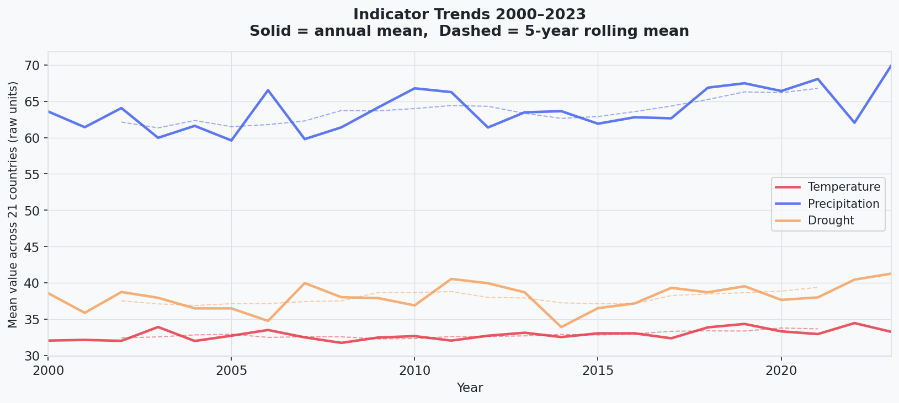

# Climate Risk Exposure Index

A transparent, reproducible composite index of physical climate hazard exposure for 21 countries, built from publicly available observed data. Designed to demonstrate the physical-risk screening methodology required by **CSRD (ESRS E1)** and **TCFD**.

[](https://www.kaggle.com/datasets/temperature001/climate-risk-exposure/data)

---

## Background

Physical climate risk is one of the most pressing challenges facing businesses, investors, and policymakers. Extreme heat, intense precipitation events, and prolonged droughts are already disrupting supply chains, damaging infrastructure, threatening agricultural output, and increasing insurance losses across the globe. As climate change intensifies, these hazards are expected to worsen, making structured, evidence-based exposure assessment an operational necessity rather than a regulatory formality.

Regulatory frameworks have formalised this expectation. The **Corporate Sustainability Reporting Directive (CSRD)**, through its European Sustainability Reporting Standard **ESRS E1**, requires companies to identify, assess, and disclose their exposure to physical climate hazards in a systematic and auditable manner. The **Task Force on Climate-related Financial Disclosures (TCFD)** similarly requires organisations to identify physical risks affecting their assets, operations, and supply chains, both under current conditions and under forward-looking scenarios. Both frameworks share a common requirement: the methodology behind any risk assessment must be documented, transparent, and reproducible.

This project responds to that requirement. It builds a country-level physical hazard exposure index from raw, openly licensed climate data, making every methodological choice explicit.

---

## Aims and Objectives

**Overall aim:** To evaluates how physical climate risk exposure is distributed across regions, in line with TCFD and CSRD physical-risk requirements.

**Specific objectives:**

1. Identify and select relevant physical climate hazard indicators from authoritative data, with a documented rationale for inclusion and exclusion
2. Assess exposure consistently across countries by normalising indicators onto a common scale and combining them into a composite score
3. Rank and prioritise countries by exposure, and present results so a non-technical reader can interpret them
4. Interpret the results: identify which hazards drive exposure in the highest-risk countries, and test how sensitive the ranking is to weighting choices

---

## Alignment with CSRD and TCFD

| Framework | Requirement | How this index addresses it |
|---|---|---|
| **CSRD (ESRS E1)** | Assess and disclose exposure to physical climate hazards | Provides a documented, auditable country-level exposure score across three hazard dimensions |
| **CSRD (ESRS E1)** | Use a systematic, reproducible methodology | Four-step OECD/JRC composite indicator method; all steps documented and version-controlled |
| **TCFD Physical Risk** | Identify current physical risks to assets and operations | Country-level screening identifies high-priority geographies for deeper asset-level assessment |
| **TCFD Physical Risk** | Consider acute and chronic hazards | Three indicators span acute events (extreme heat, extreme precipitation) and chronic hazards (drought) |

This index demonstrates the **country screening stage** of a physical-risk programme, the first-pass step that identifies which geographies warrant closer attention before asset-level and scenario-based analysis is conducted.

---

## Data

**Source:** World Bank Climate Change Knowledge Portal (CCKP), ERA5 0.25-degree observed historical data. **Licence: CC-BY 4.0.**

> The World Bank, Climate Change Knowledge Portal (CCKP). ERA5 observed historical data, 2000–2023.
> https://climateknowledgeportal.worldbank.org

**Temporal scope:** 2000–2023 (24 years of observed data). Projection data was excluded; the index measures current exposure based on observed conditions.

**Indicators:**

| Indicator | Hazard dimension | Units | Rationale |
|---|---|---|---|
| Maximum of daily maximum temperature (txx) | Heat | °C | Captures temperature extremes, not just averages, a truer heat-hazard proxy |
| Largest 5-day cumulative precipitation (rx5day) | Flooding | mm | Maps directly to extreme rainfall and flood-generating events |
| Maximum consecutive dry days (cdd) | Drought | days | Captures water deficit without cancelling against the precipitation indicator |

A Pearson correlation check confirmed that all three indicators add distinct information (precipitation ↔ drought: r = 0.513, below the |r| ≥ 0.70 redundancy threshold). The temperature ↔ drought correlation (r = 0.818) is noted as a limitation.

**Countries (21):**

| Group | Countries |
|---|---|
| European (14) | Netherlands, United Kingdom, France, Germany, Belgium, Spain, Italy, Portugal, Denmark, Sweden, Norway, Poland, Greece, Ireland |
| African (3) | Nigeria, Kenya, South Africa |
| Global anchors (4) | United States, Australia, India, Brazil |

The sample is Europe-weighted to reflect the CSRD regulatory context. African and global anchor countries widen the hazard range and serve as validation anchors.

---

## Methodology

The index follows the **OECD/JRC Handbook on Constructing Composite Indicators** four-step process:

**Step 1 - Indicator selection:** Three hazard indicators selected from CCKP ERA5 data; redundancy checked via correlation matrix before finalising the set.

**Step 2 - Normalisation:** Min-max rescaling of each indicator to a 0–1 range across the 21-country sample.

$$x_{norm} - \frac{x - x_{min}}{x_{max} - x_{min}}$$

**Step 3 - Weighting:** Equal weights (1/3 each) applied as the transparent default in the absence of empirical evidence for differential weighting.

**Step 4 - Aggregation:** Linear weighted sum to produce a composite exposure score (0 = least exposed, 1 = most exposed).

$$\text{Composite Score} = \frac{1}{3} \cdot \text{Temperature}_{norm} + \frac{1}{3} \cdot \text{Precipitation}_{norm} + \frac{1}{3} \cdot \text{Drought}_{norm}$$

A **sensitivity analysis** across five alternative weighting schemes tests whether the ranking depends on the equal-weighting assumption.

---

## Key Results

### Overall Ranking

Composite scores range from 0.074 (Ireland) to 0.878 (India). The median score is 0.250, indicating a right-skewed distribution - a small group of countries at the top is substantially more exposed than the majority.



| Rank | Country | Composite Score | Temperature | Precipitation | Drought |
|---|---|---|---|---|---|
| 1 | India | 0.878 | 0.901 | 1.000 | 0.735 |
| 2 | Nigeria | 0.785 | 0.897 | 0.509 | 0.948 |
| 3 | Australia | 0.742 | 1.000 | 0.227 | 1.000 |
| 4 | Portugal | 0.575 | 0.720 | 0.533 | 0.471 |
| 5 | Brazil | 0.570 | 0.679 | 0.546 | 0.486 |
| 6 | Kenya | 0.564 | 0.667 | 0.204 | 0.820 |
| 7 | South Africa | 0.479 | 0.720 | 0.091 | 0.625 |
| 8 | Greece | 0.449 | 0.617 | 0.360 | 0.369 |
| 9 | Spain | 0.393 | 0.683 | 0.145 | 0.350 |
| 10 | Italy | 0.359 | 0.504 | 0.404 | 0.168 |
| 11 | France | 0.250 | 0.542 | 0.157 | 0.050 |
| 12 | United States | 0.245 | 0.536 | 0.000 | 0.198 |
| 13 | Belgium | 0.221 | 0.496 | 0.144 | 0.023 |
| 14 | Germany | 0.209 | 0.514 | 0.095 | 0.018 |
| 15 | Poland | 0.208 | 0.492 | 0.093 | 0.038 |
| 16 | Netherlands | 0.200 | 0.478 | 0.095 | 0.026 |
| 17 | Norway | 0.098 | 0.000 | 0.293 | 0.000 |
| 18 | Denmark | 0.088 | 0.171 | 0.057 | 0.036 |
| 19 | United Kingdom | 0.080 | 0.088 | 0.141 | 0.011 |
| 20 | Sweden | 0.080 | 0.146 | 0.059 | 0.035 |
| 21 | Ireland | 0.074 | 0.020 | 0.197 | 0.005 |

### Hazard Profile by Country

The heatmap shows that high-ranking countries reach their scores through different hazard combinations - not a single shared driver.



### Hazard Driver Decomposition

India is the only country to score above 0.9 on two indicators simultaneously (temperature and precipitation). Australia anchors the maximum on both temperature and drought. Nigeria's score is dominated by drought and heat. The decomposition makes clear that the same composite score can arise from very different hazard profiles, a distinction that matters for risk management.



### Sensitivity Analysis

The ranking was recalculated under five alternative weighting schemes. India and Nigeria hold ranks 1 and 2 under every scheme. The three-tier structure of the ranking - high-exposure tropical and semi-arid countries, mid-range Mediterranean countries, low-exposure northern European countries - is stable throughout.



### Indicator Trends 2000-2023



---

## Conclusions

The index produces a geographically coherent result that is robust to weighting assumptions. India, Nigeria, and Australia are the most exposed countries by a substantial margin, each for different reasons:
1. India through broad-spectrum exposure across all three hazards;
2. Nigeria through extreme heat and drought;
3. Australia through maximum values on temperature and drought.

A clear regional divide separates tropical and semi-arid countries from the European sample, with Mediterranean countries forming a distinct mid-range group driven by heat and seasonal water deficit.

Two counterintuitive results are worth noting:

- **Netherlands ranks 16th** despite its global reputation for flood risk. Its flood exposure arises from sea level and river flooding, not extreme rainfall intensity, which the rx5day indicator does not capture. This points directly to the most important gap in the current indicator set.
- **United States ranks 12th** because the index uses national averages, which mask enormous internal variation across a climatically diverse country. Sub-national analysis would produce dramatically different results for states like Florida, California, or Texas.

For corporate disclosure, the key takeaway from this index is not the composite number, it is the **hazard decomposition**. Knowing that Australia's exposure is driven by heat and drought, not flooding, determines which interventions to prioritise and which TCFD risk categories to assess in depth.

---

## Limitations

| Limitation | Implication |
|---|---|
| Country-level aggregation | Masks sub-national variation; large, diverse economies (United States, India, Brazil) require sub-national analysis |
| Sea level excluded | Understates flood exposure for low-lying European countries (Netherlands, Belgium, Denmark, United Kingdom)|
| Historical data only | Does not satisfy the forward-looking requirement of TCFD; CMIP6 scenario extension needed |
| Annual aggregates | Did not capture within-year compound hazards (e.g. simultaneous heat and drought) |
| Temperature ↔ drought correlation (r = 0.818) | Partially double-weights the hot-and-dry hazard profile of tropical countries |
| Min-max sensitivity | Adding or removing one extreme country shifts all normalised scores |

---

## Repository Structure

```
├── 01_data_assembly.ipynb          # Load CCKP files → 504-row panel CSV
├── 02_index_construction.ipynb     # Normalise, weight, rank → outputs + charts
│
├── cckp_raw/
│   └── exposure_panel.csv          # Assembled panel: 504 rows × 5 cols
│
├── outputs/
│   ├── exposure_index_results.csv  # Final ranked results (21 rows)
│   ├── dashboard.html              # Interactive dashboard (download to view)
│   └── *.png                       # Six static visualisations
│
└── LICENSE
```

---

## How to Reproduce

```bash
pip install pandas numpy matplotlib plotly openpyxl
```

Run notebooks in order:
1. `01_data_assembly.ipynb` — assembles `exposure_panel.csv` from raw CCKP files
2. `02_index_construction.ipynb` — builds the index and saves all charts to `outputs/`

The interactive dashboard (`outputs/dashboard.html`) is included in the repository — download and open in any browser to explore the results.

The processed dataset (exposure_panel.csv and exposure_index_results.csv) is also available on [Kaggle](https://www.kaggle.com/datasets/temperature001/climate-risk-exposure/data).

Raw CCKP source files (one `.xlsx` per country) can be downloaded from the [World Bank Climate Change Knowledge Portal](https://climateknowledgeportal.worldbank.org) using the ERA5 historical dataset for txx, rx5day, and cdd indicators.

---

## Licence

Code and methodology: **MIT**
Data: **CC-BY 4.0** (World Bank CCKP)
